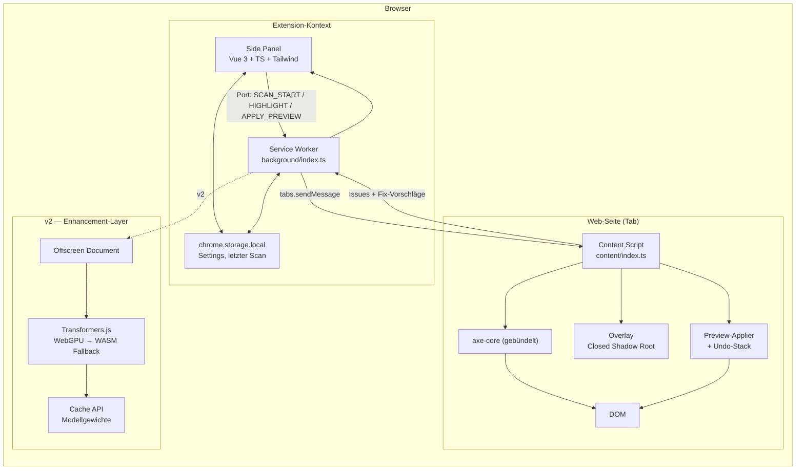

# Architektur — vantra-a11y-fixer

## 1. Komponenten



Zuständigkeiten, hart abgegrenzt:

| Schicht | Verantwortung | Bewusst NICHT |
| --- | --- | --- |
| Content Script | axe-core ausführen, DOM messen, Overlay zeichnen, Preview anwenden/zurücksetzen | UI-Logik, Persistenz |
| Fix-Engine (`packages/fix-engine`) | reine Funktionen: Issue → Fix-Vorschlag | DOM-Zugriff, Chrome-APIs |
| Side Panel | Darstellung, Navigation, Filter, Clipboard | Scannen, direktes DOM-Antasten |
| Service Worker | Routing zwischen Panel und Tab, Lifecycle, Tab-Wechsel-Invalidierung | Rechenarbeit |
| Storage | Settings + letztes Scan-Ergebnis pro Tab-Session | Scan-Historie, Sync, Remote |

Die Fix-Engine ist **framework- und browserfrei** (nur TS, keine DOM-Typen im Kern) — dadurch
mit Vitest unit-testbar und später in `@vantra-design/core`-CI-Tools wiederverwendbar.

## 2. Datenmodell (Wire-Format Panel ↔ Content Script)

```ts
type Category = 'contrast' | 'semantics' | 'structure' | 'interaction' | 'manual';
type Severity = 'critical' | 'high' | 'medium' | 'advisory' | 'manual';
type Confidence = 'high' | 'medium' | 'review';

interface IssueOccurrence {
  selector: string;          // eindeutiger CSS-Pfad
  html: string;              // gekürzter Outer-HTML-Ausschnitt
  rect: { x: number; y: number; w: number; h: number };
}

interface FixProposal {
  id: string;
  kind: 'css' | 'attribute';
  confidence: Confidence;
  rationale: string;         // Klartext, warum dieser Wert
  before: Record<string, string>;
  after: Record<string, string>;
  snippet: { css?: string; html?: string };
  metrics?: { contrastBefore: number; contrastAfter: number; target: number };
}

interface IssueCluster {
  id: string;
  ruleId: string;            // axe-Rule-ID, für Nachvollziehbarkeit
  category: Category;
  severity: Severity;
  wcag: { sc: string; level: 'A' | 'AA' | 'AAA'; title: string };
  title: string;             // nutzerzentriert, nicht axe-Wortlaut
  explanation: string;
  occurrences: IssueOccurrence[];
  proposals: FixProposal[];  // leer ⇒ nur manuelle Anleitung
  manualGuidance?: string;
}

interface ScanResult {
  url: string;
  scannedAt: number;
  targetLevel: 'A' | 'AA' | 'AAA';
  axeVersion: string;
  elementCount: number;
  clusters: IssueCluster[];
}
```

Clustering-Schlüssel: `ruleId` + normalisierter Fix-Fingerprint (z. B. Ist/Soll-Farbpaar).

## 3. Fix-Engine

```ts
interface FixProvider {
  readonly id: string;
  supports(issue: NormalizedIssue): boolean;
  propose(issue: NormalizedIssue, ctx: FixContext): FixProposal[];
}
```

MVP-Provider:

1. **ContrastFixProvider** — deterministisch, `confidence: 'high'`.
   - Farben in OKLCH umrechnen, Lightness monoton verschieben, Hue/Chroma halten,
     Zielkontrast (4.5:1 / 3:1 large / 7:1 AAA) per Binärsuche über WCAG-2-Ratio treffen.
   - Zwei Varianten anbieten: Vordergrund anpassen · Hintergrund anpassen.
   - Optionales Einrasten auf die nächste erlaubte Token-Farbe (Vantra-Palette oder
     eigene Palette aus Settings) — dann `confidence: 'medium'`.
   - Kein Vorschlag bei Hintergrundbild/Gradient/`currentColor`-Unschärfe →
     `manualGuidance` + Marker „v2: visuelle Analyse".
2. **AriaNameFixProvider** — Heuristik, `confidence: 'medium'|'review'`.
   - Namensquelle in Reihenfolge: sichtbarer Text → `title` → `alt` verschachtelter Bilder →
     `aria-labelledby`-Kandidat in der Nähe → Icon-Klassenname (`.icon-close` → „Schließen").
   - Ergebnis ist ein Vorschlag, nie eine Behauptung: Textfeld im Panel editierbar.
3. **LabelAssociationFixProvider** — `label for`/`id`-Verknüpfung, `aria-describedby` für
   Hilfetexte; erzeugt HTML-Diff statt Attribut-Injektion, wenn Struktur geändert werden muss.
4. **RoleHeuristicFixProvider** — falsche/redundante Rollen (`role="button"` auf `<button>`),
   `div`-Klick-Handler → `<button>`-Empfehlung; überwiegend `confidence: 'review'`.

v2-Provider (gleiches Interface, additiv): `AltTextVisionProvider`,
`BackgroundContrastVisionProvider`, `ExplanationProvider`.

## 4. Messaging

Long-lived `chrome.runtime.connect`-Port pro Panel-Instanz, Nachrichten als
diskriminierte Union in `packages/protocol`:

`SCAN_START` · `SCAN_PROGRESS` · `SCAN_RESULT` · `SCAN_ERROR` · `HIGHLIGHT` ·
`APPLY_PREVIEW` · `REVERT_PREVIEW` · `REVERT_ALL` · `SETTINGS_CHANGED` · `PAGE_NAVIGATED`

Regeln: Content Script ist bei Navigation zustandslos neu injiziert; `PAGE_NAVIGATED`
invalidiert das Panel-Ergebnis (kein stilles Anzeigen veralteter Befunde).

## 5. Repo-Layout

```text
vantra-a11y-fixer/
  apps/extension/
    src/
      background/index.ts
      content/{index.ts,overlay.ts,applier.ts,axe-runner.ts,selector.ts}
      panel/{main.ts,App.vue,views/,components/,composables/,styles/}
      shared/{settings.ts,storage.ts}
    public/{manifest.json,icons/}
    vite.config.ts
  packages/
    fix-engine/     # reine TS-Logik + Vitest
    protocol/       # Message-Typen, ScanResult-Schema
    a11y-math/      # Kontrast, sRGB/OKLCH-Konvertierung, Zielsuche
  docs/{PRD.md,IA.md,ARCHITECTURE.md,LICENSING-DECISION.md}
  tests/{unit,e2e}  # e2e: Playwright mit geladener Extension
  LICENSE
  LICENSE-THIRD-PARTY.md
  CONTRIBUTING.md
```

Build: Vite + `@crxjs/vite-plugin` (MV3), pnpm-Workspace, Node ≥ 24 (konsistent mit
`vantra-governance-suite`), ESLint-Flat-Config und `tsconfig.base.json` aus dem
bestehenden Vantra-Setup übernommen.

## 6. Privacy-Architektur (hartes Constraint)

- `manifest.json`: `permissions: ["activeTab", "scripting", "sidePanel", "storage"]`.
  **Kein** `host_permissions: ["<all_urls>"]`, kein `tabs`, kein `webRequest`.
- CSP: `extension_pages: "script-src 'self'; object-src 'self'; connect-src 'none'"`.
  Damit ist jeder Netzwerk-Call aus Extension-Seiten browserseitig blockiert — das macht
  die Network-Zero-Behauptung strukturell prüfbar statt bloß behauptet.
- axe-core wird gebündelt ausgeliefert, kein CDN. Keine Analytics, keine Sentry, keine Fonts
  von extern (Schriften lokal einbetten).
- Screenshot-Ausschnitte für die Issue-Detailansicht entstehen über `captureVisibleTab`
  und bleiben im Speicher der Panel-Instanz; nichts wird persistiert.
- v2-Modelldownload ist der **einzige** je erlaubte Netzwerkvorgang: explizit vom Nutzer
  ausgelöst, mit Quelle, Größe und SHA-256-Checksumme, danach Cache-API-offline.
  Er läuft in einem separaten Offscreen-Dokument mit eigener, engerer CSP-Ausnahme.

## 7. Testing

| Ebene | Werkzeug | Gegenstand |
| --- | --- | --- |
| Unit | Vitest | `a11y-math` (Kontrastwerte gegen WCAG-Referenztabelle), Fix-Provider, Clustering |
| Fixture | Vitest + jsdom | HTML-Fixtures mit bekannten Verstößen → erwartete Cluster |
| E2E | Playwright (persistent context, Extension geladen) | Scan-Flow, Overlay-Positionen, Preview/Undo, Clipboard |
| Dogfooding | Playwright + `@axe-core/playwright` gegen die Panel-Seite | Release-Gate: 0 offene AA-Violations |
| Manuell | Screenreader-Checkliste (VoiceOver/NVDA), 200-%-Zoom, Tastatur-Only | vor jedem Tag |

Regressionsschutz: jede gemeldete False-Positive wird als Fixture eingecheckt, bevor der
Provider angepasst wird.
