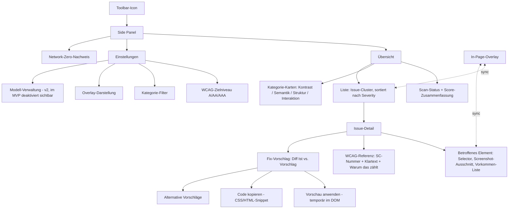
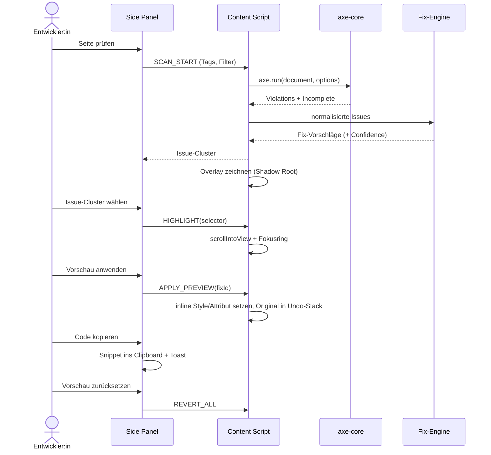

# Informationsarchitektur — vantra-a11y-fixer

## 1. Terminologie-Guardrails (verbindlich für UI-Strings, Docs, Commits)

| Verwenden | Nicht verwenden | Grund |
| --- | --- | --- |
| Issue | Fehler, Bug, Verstoß | wertneutral, kein Schuld-Framing |
| Fix-Vorschlag | Auto-Fix, Lösung | keine Vollautomatik suggerieren |
| Anwenden (Vorschau) | Reparieren, Beheben | temporär und reversibel |
| Prüfung / Scan | Audit, Zertifizierung | kein rechtlicher Anspruch |
| Nicht automatisch prüfbar | „bestanden" | ehrlich zur ~30–40-%-Abdeckung |
| Betroffenes Element | Ziel, Node | für Devs ohne A11y-Hintergrund |

Severity-Skala (aus axe-core gemappt, nicht 1:1 übernommen):
`Kritisch` · `Hoch` · `Mittel` · `Hinweis` · `Manuelle Prüfung nötig`.

## 2. Issue-Taxonomie (die zentrale IA-Entscheidung)

Erste Sortier-Ebene ist **nicht** die axe-Rule-ID (zu technisch), sondern eine
nutzerzentrierte Kategorie. Jede Kategorie hat eine feste Farbe, die Overlay und Panel teilen.

```text
Kontrast          (rot)     → Text/Grafik unlesbar        · axe: color-contrast, color-contrast-enhanced
Semantik & ARIA   (gelb)    → falsch/fehlend beschriftet  · axe: aria-*, button-name, link-name, label, image-alt
Struktur          (blau)    → Navigation/Orientierung     · axe: landmark-*, heading-order, region, list
Interaktion       (violett) → Fokus, Tastatur, Targets    · axe: tabindex, focus-order-semantics, target-size
Nicht auto-prüfbar (grau)   → axe „incomplete" + manuelle Checks
```

Zweite Ebene: **WCAG-Level** (A / AA / AAA) — filterbar, nicht gruppierend, damit die
Standardansicht nach Wirkung sortiert bleibt, nicht nach Normhierarchie.

Dritte Ebene: **Muster-Clustering.** Mehrere Vorkommen derselben Rule mit identischem
Fix-Vorschlag werden zu einer Karte zusammengefasst („12 Elemente, 1 Fix-Vorschlag").
Das ist der Hebel für Design-System-Teams.

## 3. Sitemap



## 4. Kern-Flow: von Befund zu Fix



## 5. Wireframe-Beschreibung

### 5.1 In-Page-Overlay

- Ein `<vantra-a11y-overlay>`-Host-Element am `<body>`-Ende, **Closed Shadow Root**, damit
  Seiten-CSS nicht durchschlägt und die Extension die Seite nicht kontaminiert.
- Pro Issue ein absolut positioniertes Rechteck (`position: fixed`, aus `getBoundingClientRect`),
  2 px Outline in Kategoriefarbe, 3 px versetzt nach außen, kein Layout-Eingriff.
- Badge oben links am Rechteck: Kategorie-Icon + Anzahl bei überlappenden Issues.
- `pointer-events: none` auf dem Container, `auto` nur auf Badges — Seite bleibt bedienbar.
- Hover/Fokus auf Badge → Tooltip: Kategorie · Kurztitel · Severity · „Details im Panel".
- Reposition via `ResizeObserver` + throttled `scroll`/`resize`, `IntersectionObserver` zum
  Ausblenden außerhalb des Viewports.
- Overlay ist per Tastatur erreichbar: Badges in Roving-Tabindex-Gruppe, `Escape` schließt Tooltip.
- Reduced-Motion respektiert; ausschließlich Farbe kodiert **nie** allein die Bedeutung
  (Icon + Text ergänzen die Farbe → SC 1.4.1).

### 5.2 Side Panel — Übersicht

```text
┌───────────────────────────────────────────┐
│ VANTRA  A11y            [Prüfen]  [⚙]     │  Header, sticky
├───────────────────────────────────────────┤
│ example.com/pricing · 14:22 · 312 Elemente│  Scan-Kontext
│ Ziel: WCAG 2.2 AA                          │
├───────────────────────────────────────────┤
│ 7 Kontrast   4 Semantik   2 Struktur      │  Kategorie-Karten,
│ 1 Interaktion   5 manuell prüfen          │  klickbar = Filter
├───────────────────────────────────────────┤
│ Filter: [A][AA][AAA]  Sortierung: Severity│
├───────────────────────────────────────────┤
│ ▸ Kritisch · Kontrast                     │  Issue-Cluster-Karte
│   Text 2.8:1 auf Primärbuttons            │
│   12 Elemente · 1 Fix-Vorschlag           │
│   SC 1.4.3                                │
├───────────────────────────────────────────┤
│ ▸ Hoch · Semantik & ARIA                  │
│   Buttons ohne zugänglichen Namen         │
│   3 Elemente · 2 Fix-Vorschläge           │
└───────────────────────────────────────────┘
```

Leerzustände: **vor dem Scan** (Erklärung + primärer Button), **0 Issues** (explizit
„Keine automatisch prüfbaren Issues gefunden — das ist keine Konformitätsbestätigung",
plus Link auf manuelle Checkliste), **Scan nicht möglich** (`chrome://`, PDF, Store-Seiten).

### 5.3 Side Panel — Issue-Detail

Reihenfolge folgt der Frage-Kette „Was? Wo? Warum? Was tun?":

1. **Titel + Severity + Kategorie-Chip**, WCAG-SC-Chip.
2. **Was ist das Problem** — 1–2 Sätze Klartext, kein Norm-Jargon; „Warum das zählt"
   als aufklappbare Zeile (Betroffene Nutzergruppen).
3. **Betroffene Elemente** — Liste der Vorkommen mit CSS-Selector (kopierbar), Screenshot-
   Ausschnitt und `Im Seiteninhalt zeigen`-Button (scrollt + hebt hervor).
4. **Fix-Vorschlag** — Diff-Ansicht, zwei Spalten bzw. gestapelt bei < 420 px:

   ```text
   Ist                          Vorschlag
   color:  #8a8a8a  ▢           color:  #595959  ▢
   Kontrast 2.9:1  ✗ AA         Kontrast 4.6:1  ✓ AA   (Δ Hue 0°, L −18 %)
   ```

   Bei ARIA analog als Attribut-Diff (`- aria-label fehlt` / `+ aria-label="Menü öffnen"`).
   Jeder Vorschlag trägt ein Confidence-Label (`Hoch` = deterministisch berechnet,
   `Mittel` = Heuristik, `Prüfen` = Kontext nötig).
5. **Aktionen** — `Vorschau anwenden` (Toggle, reversibel) · `Code kopieren`
   (CSS / HTML / beide) · `Alternative Vorschläge` (z. B. Hintergrund abdunkeln statt
   Text aufhellen; Farbe im Token-Raster einrasten).
6. **Nicht automatisch behebbar** → statt Aktionen eine konkrete manuelle Anleitung.

### 5.4 Side Panel — Einstellungen

WCAG-Zielniveau (A/AA/AAA) · Kategorie-Filter · Overlay-Optionen (an/aus, Kontur-Stärke,
Farbenblind-taugliche Palette) · Fix-Präferenzen (Text vs. Hintergrund zuerst anpassen,
optional an Vantra-Token-Palette einrasten) · Modell-Verwaltung (v2: Download, Größe,
Löschen — im MVP sichtbar deaktiviert mit „ab v2") · Datenschutz.

### 5.5 Network-Zero-Nachweis

Eigene Panel-Sektion, nicht in Einstellungen versteckt, weil sie Positionierung trägt:

- Klartext: „Diese Extension sendet keine Daten. Alle Prüfungen laufen im Browser."
- Manifest-Auszug read-only: `host_permissions`, CSP, `connect-src 'none'`.
- **Live-Zähler ausgehender Requests der Extension: 0**, plus Anleitung zur eigenen
  Verifikation über DevTools-Network-Tab des Extension-Kontexts.

## 6. Dogfooding-Anforderungen an das Panel selbst (WCAG 2.2 AA)

- Vollständige Tastaturbedienung, sichtbarer Fokus ≥ 3:1 (SC 2.4.11 Focus Not Obscured,
  SC 2.4.13 Focus Appearance).
- Kategorie-Karten sind echte `button`s mit `aria-pressed`, keine `div`s.
- Issue-Liste als `role="list"`; Scan-Status via `aria-live="polite"`.
- Ziel-Größen ≥ 24 px (SC 2.5.8), Zoom bis 200 % ohne horizontales Scrollen.
- Farbe nie einziger Bedeutungsträger (Icon + Label immer dabei).
- Vantra-Palette geprüft: `#021f94` auf `#f5f2f3` ≈ 11:1 (AAA-Text ok);
  `#50e8f4` auf `#001619` ≈ 12:1 ok, **`#50e8f4` als Text auf `#f5f2f3` fällt durch** →
  Cyan nur auf dunklem Grund oder als Fläche/Akzent, nie als Text auf Hell.
